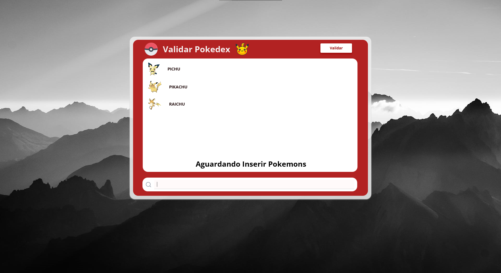
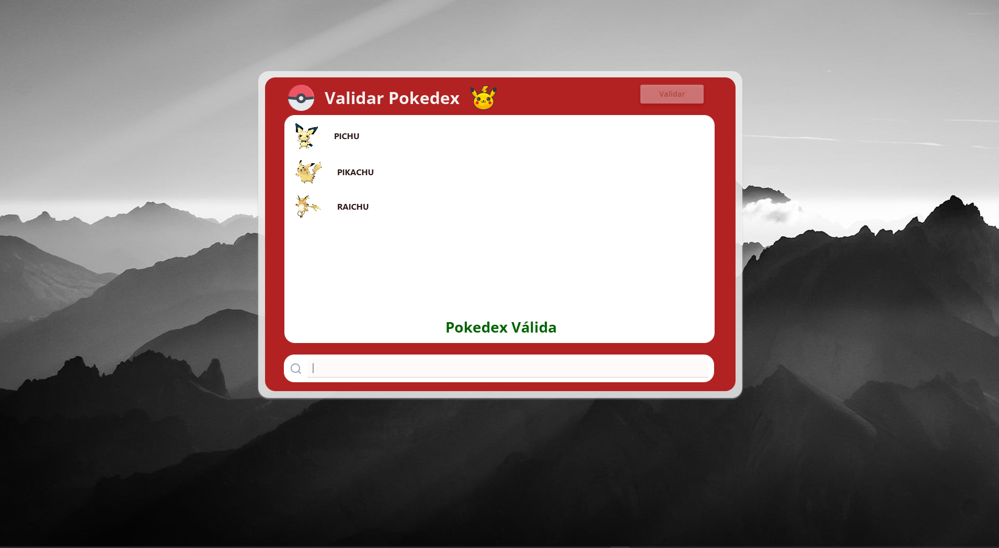
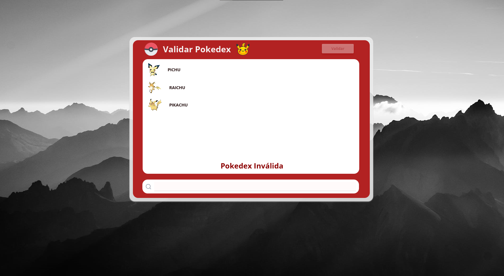

# Projeto: LeetCode + PokeAPI

## 📋 Conteúdos
1. [Sobre o Repositório](#-sobre-o-repositório)
2. [Participantes](#-participantes)
3. [Como utilizar](#-como-utilizar)
4. [LeetCodes](#-leetcodes)
5. [API Utilizada - PokéAPI](#api-section)
6. [Imagens](#-imagens)

## 📂 Sobre o Repositório
O presente respositório foi construido com o objetivo de atender a um desafio prático de faculdade, entitulado: Algoritmos em Grafos - Da Teoria ao Mundo Real. 
Tal desafio busca conciliar algoritmos desenvolvidos para solucionar LeetCodes (sobre grafos e de nível médio) com o consumo de dados de APIs. Afim de se obter um algoritmo que solucione um problema ou gere informações úteis com os dados de uma API
O repositório escolheu os LeetCodes 207 (Course Schedule) e o 310 (Minimum Height Trees) para serem solucionados, sendo o LeetCode 207 o algoritmo que funciona com dados da API.

O projeto tem a ideia de ser uma interface (feita com javafx) que verifica se os pokémons inseridos são válidos e de uma mesma linha de evolução.

[Voltar ao topo ⬆️](#topo)

## 👥 Participantes
O projeto em questão foi desenvolvido por:
* [Edvaldo](https://github.com/edvaldo-f)
* [Andrey](https://github.com/AndreyDeyvison)

[Voltar ao topo ⬆️](#topo)

## 🎮 Como utilizar
### Pré-requisitos
* JDK 11 ou superior
* Maven
### Clonando o repositório
* Em seu terminal, execute o comando:
  * git clone https://github.com/AndreyDeyvison/PokeAPI-Teste.git
  * cd PokeAPI-Teste
### Configuração do projeto
* O projeto utiliza a PokéAPI, que não requer chave de acesso (API Key). Basta garantir que você esteja conectado à internet para que as consultas funcionem.
### Execução
* Você pode rodar o projeto através de sua IDE de preferência
* ou via terminal com o Maven:
  * mvn clean javafx:run
### Utilizando a interface
1. O usuário têm um campo de pesquisa ao final da tela, onde pode inserir nomes de pokémon válidos (presentes na API)
2. Ao inserir o nome e apertar "Enter", o campo é limpo, junto ao nome e foto do pokémon aparecerem na caixa acima
3. O usuário pode finalizar a operação, quando quiser, clicando no botão "Validar" para verificar seus pokémon
4. Caso a lista de pokémon sejam da mesma evoluções válidas, e na ordem, é retornado a mensagem "Pokédex Válida."

[Voltar ao topo ⬆️](#topo)

## 💻 LeetCodes
Abaixo seguem explicações e mais detalhes sobre os LeetCodes (207 e 310, respectivamente).

### [LeetCode 207 - Course Schedule](https://leetcode.com/problems/course-schedule/description/?envType=problem-list-v2&envId=wdd68e3g)
O algoritmo utiliza uma abordagem baseada na detecção de ciclos em um grafo direcionado através de uma matriz de adjacência.

#### Complexidade de Tempo: O(V^3)
* Inicialização: Criar a matriz "matrizFinal" leva O(V^2).
* Processamento de Arestas: O preenchimento inicial das arestas leva O(E).
* Loop Triplo: Existem três loops aninhados que percorrem de 0 a "numCourses" (V). A operação interna é executada exatamente V * V * V vezes.
* Verificação Final: Um loop simples de O(V) para verificar a diagonal principal.
* Dominante: O termo de maior ordem é V^3, resultando em O(V^3).

#### Complexidade de Espaço: O(V^2)
* O algoritmo aloca uma matriz bidimensional "int[V][V]". Portanto, o consumo de memória escala quadraticamente com o número de cursos: O(V^2).

* Pode considerar O(V) como o clássico O(n)

### [LeetCode 310 - Minimum Height Trees](https://leetcode.com/problems/minimum-height-trees/description/?envType=problem-list-v2&envId=wdd68e3g)
O algoritmo utiliza uma lógica que remove folhas, em camadas, da árvore de um grafo (remoção iterativa de folhas), como em uma ordenação topológica, para encontrar o centro do grafo.

#### Complexidade de Tempo: O(V)
* Construção do Grafo: É criada uma lista de adjacência e o preenchimento dos graus levam O(V + E). Como o problema trata de uma árvore, E = V - 1, simplificando para O(V).
* Busca das Folhas: Um loop de O(V) para identificar nós com grau 1.
* Processamento da Fila: Cada nó é inserido e removido da fila exatamente uma vez. Cada aresta é visitada um número constante de vezes para decrementar o grau dos vizinhos.
* Total: A execução é linear em relação ao número de nós: O(V).

#### Complexidade de Espaço: O(V)
* Estruturas de Dados:
    * Lista de adjacência: O(V + E) -> O(V).
    * Array de graus: O(V).
    * Fila de folhas: O(V).

* Pode-se considerar O(V) como o clássico O(n)

[Voltar ao topo ⬆️](#topo)

## 🗄️ API Utilizada - PokéAPI 
A API escolhida para obter dados foi a [PokéAPI](https://pokeapi.co/), uma API RESTful contendo diversos dados sobre Pokémon.

### 🛠️ Informações técnicas
* **Documentação oficial:** [:link: Clique aqui para acessar](https://pokeapi.co/docs/v2)
* **Finalidade:** A escolha dessa API se deu pela sua vasta quantidade de dados, se tratar de um assunto conhecido (Pokémon) e ser de fácil implementação.
* **Autenticação:** Open-source e gratuita.

### 📊 Exemplo de Estrutura de resposta (JSON)
* Endpoint GET: https://pokeapi.co/api/v2/characteristic/{id}/

´{
  "id": 1,
  "gene_modulo": 0,
  "possible_values": [
    0,
    5,
    10,
    15,
    20,
    25,
    30
  ],
  "highest_stat": {
    "name": "hp",
    "url": "https://pokeapi.co/api/v2/stat/1/"
  },
  "descriptions": [
    {
      "description": "Loves to eat",
      "language": {
        "name": "en",
        "url": "https://pokeapi.co/api/v2/language/9/"
      }
    }
  ]
}´

[Voltar ao topo ⬆️](#topo)

## 📷 Imagens

[Voltar ao topo ⬆️](#topo)
